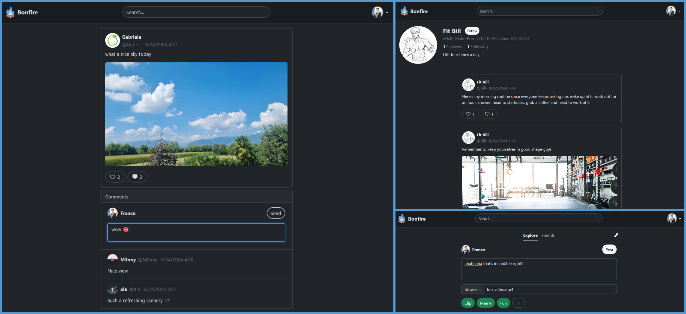
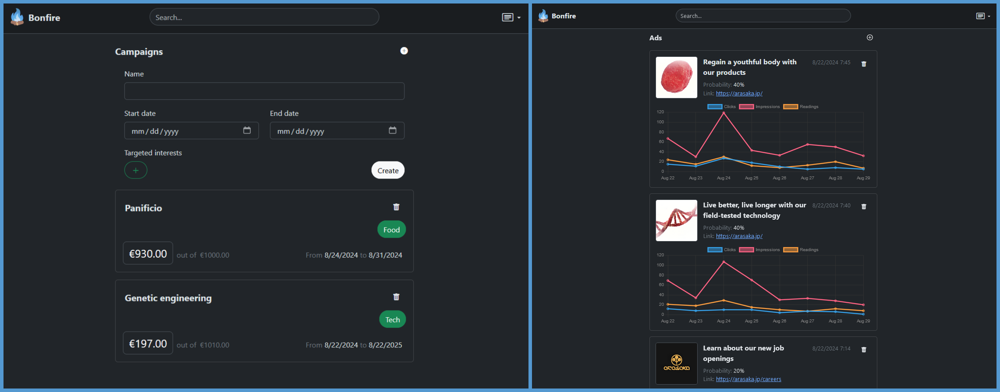


<p align="center">
	<br/>
</p>

# Bonfire

A RESTful social network prototype made in Flask and SQLAlchemy

## Table of Contents

- 📝 [About](#about)
- ⭐ [Features](#features)
- 🖼️ [Screenshots](#screenshots)
- ⚙️ [Local Execution](#local-execution)

## About

This was a project for a university course focused on the backend side of a web app.
We were mostly free to design the frontend as we liked, but we had to follow the project guidelines for the backend, which also included the basic features that our app needed to implement.

## Features

You can register for the app under two roles: **user** and **advertiser**.

As a user, you can:
- Explore content posted by anyone on the platform.
- Explore content posted by your friends on the platform.
- Interact with posts through likes and comments.
- Create posts that support text-only, images (+text), and videos (+text).
- Customize your profile.
- Search for specific users on the platform.
- Follow others and get followed.

As an advertiser, you can:
- Explore content posted by anyone on the platform.
- Search for specific users on the platform.
- Customize your profile.
- Manage your advertising campaigns (create new ones, increase the budget, set the target audience for each campaign).
- Manage the ads within a specific campaign (create new ads by specifying the image or video and the referral link).
- Keep track of the statistics of the ads you’ve created (impressions, clicks, readings).

## Screenshots

### User view

<p align="center">
	<br/>
</p>

### Advertiser view

<p align="center">
	<br/>
</p>

## Local execution

1. [Install the dependencies](#1-install-the-dependencies)
2. [Setup environment variables file](#2-setup-environment-variables-file)
3. [Setup the database](#3-setup-the-database)
4. [Run the server](#4-run-the-server)

### 1. Install the dependencies

After cloning the repository, you need to install all the required dependencies. This project has been developed using a PostgreSQL database, so I'll demonstrate how to set it up. However, since we used SQLAlchemy ORM, it should work with most DBMSs, with only minor modifications needed, such as removing or rewriting triggers.

#### Fedora

Install python


	$ sudo dnf install python3 python3-pip python3-venv


Install PostgreSQL

	$ sudo dnf install postgresql-server postgresql-contrib


Create a virtual environment for the python packages

	$ python3 -m venv venv

Activate the virtual environment

	$ source venv/bin/activate

Install the python packages needed. Go in the root of the project and run

	$ pip3 install -r requirements.txt

#### Debian-based

Install python

	$ sudo apt install python3 python3-pip python3-venv


Install PostgreSQL

**Note**: On WSL 1 is recommended to NOT install postgresql 14 (this version seems to have problems with database creation)

	$ sudo apt install postgresql postgresql-contrib


Create a virtual environment for the python packages

	$ python3 -m venv venv

Activate the virtual environment

	$ source venv/bin/activate

Install the python packages needed. Go in the root of the project and run

	$ pip3 install -r requirements.txt


### 2 Setup environment variables file

In the root of the project create a file named `.env`, it should look like this

```bash
DB_DRIVER_NAME="postgresql"
DB_USERNAME="<username>"
DB_PASSWORD="<password>"
DB_HOST="127.0.0.1"
DB_PORT="5432"
DB_DATABASE="<database_name>"
DB_SECRET_KEY = "random_generated_string"
DB_DEBUG = "1"
```
Compile the fields indicated by `<>` with your data.
Remember: the data you enter must match the ones used in the database configuration in the next step.


### 3 Setup the database

#### Fedora

Initialize the database

	$ sudo postgresql-setup --initdb --unit postgresql

Run the postgresql server with one of the following command based on your system:

Opt. 1

	$ sudo systemctl start postgresql

Opt. 2

	$ sudo service postgresql start

To avoid future troubleshooting, check the port number used by postgres, so run

	$ sudo cat /var/lib/pgsql/data/postgresql.conf | grep port

the port number must match the one in the `.env` file, if it is no the same adjust it in the `.env`file

Run the postgres interactive shell to create user and database

	$ sudo -u postgres psql

- Create the user (remember to match the fields entered in the `.env` file)

		postgres=# CREATE USER <username> WITH PASSWORD '<password>';


	You can check the user creation with the following command:
		
		postgres=# \du
		
- Create the database (remember to match the fields entered in the `.env` file)
	
		postgres=# CREATE DATABASE <database_name> OWNER <username>;

	You can check the database creation with the following command:
	
		postgres=# \l

Now you can grant all the priviledges to the created user for that database:

	postgres=# GRANT ALL PRIVILEGES ON DATABASE <database_name> TO <username>;


Before you can log in using the created user, you need to enable password authentication in the PostgreSQL configuration file. Open this file using your favorite text editor:

	$ sudo vim /var/lib/pgsql/data/pg_hba.conf
 
Add the following line just below the mention of `"local" is for Unix domain socket connections only` near the bottom of the file:

```
# "local" is for Unix domain socket connections only
local   all    <username>          md5
```
this allow the manual connection to the postgres shell.

Also edit the line under `IPv4 local connections` in this way

```
# IPv4 local connections:
host   all    all    127.0.0.1/32      md5
```
this allow the connection from other applications in the local network (in our case sqlalchemy)


Save the file and restart the postgres server with one of the following command based on your system

Opt. 1

	$ sudo systemctl reload postgresql

Opt. 2

	$ sudo service postgresql reload


And now you should be able to connect with the following command

	$ psql -U <username> -d <database_name>
	
Lastly you need to create the database tables, so exit from the postgres shell and run the following script:

	$ python3 create_database.py

#### Debian-based


Initialize the database

	$ sudo -u postgres pg_ctlcluster <postgres_version> main start

(you have to insert your postgres version in the related field, you can get it by running `psql --version` you only need to insert the first 2 digit, like 14, 15, etc...)

Run the postgresql server with one of the following command based on your system:

Opt. 1

	$ sudo systemctl start postgresql

Opt. 2

	$ sudo service postgresql start

To avoid future troubleshooting, check the port number used by postgres, so run

	$ sudo cat /etc/postgresql/<postgres_version>/main/postgresql.conf | grep port

the port number must match the one in the `.env` file, if it is no the same adjust it in the `.env` file

Run the postgres interactive shell to create user and database

	$ sudo -u postgres psql

- Create the user (remember to match the fields entered in the `.env` file)

		postgres=# CREATE USER <username> WITH PASSWORD '<password>';


	You can check the user creation with the following command:
		
		postgres=# \du
		
- Create the database (remember to match the fields entered in the `.env` file)
	
		postgres=# CREATE DATABASE <database_name> OWNER <username>;

	You can check the database creation with the following command:
	
		postgres=# \l

Now you can grant all the priviledges to the created user for that database:

	postgres=# GRANT ALL PRIVILEGES ON DATABASE <database_name> TO <username>;


Before you can log in using the created user, you need to enable password authentication in the PostgreSQL configuration file. Open this file using your favorite text editor:

	$ sudo vim /etc/postgresql/<postgres_version>/main/pg_hba.conf


Add the following line just below the mention of `"local" is for Unix domain socket connections only` near the bottom of the file:

```
# "local" is for Unix domain socket connections only
local   all    <username>          md5
```

this allow the manual connection to the postgres shell.

Also edit the line under `IPv4 local connections` in this way (if is already marked with "scram-sha-256" there is no need to update)

```
# IPv4 local connections:
host   all    all    127.0.0.1/32      md5
```

this allow the connection from other applications in the local network (in our case sqlalchemy)


Save the file and restart the postgres server with one of the following command based on your system

Opt. 1

	$ sudo systemctl reload postgresql

Opt. 2

	$ sudo service postgresql reload


And now you should be able to connect with the following command

	$ psql -U <username> -d <database_name>

Lastly you need to create the database tables, so exit from the postgres shell and run the following script:

	$ python3 create_database.py


### 4 Run the server

If everything has worked, you should now be able to run the server:

	$ flask run --debug
